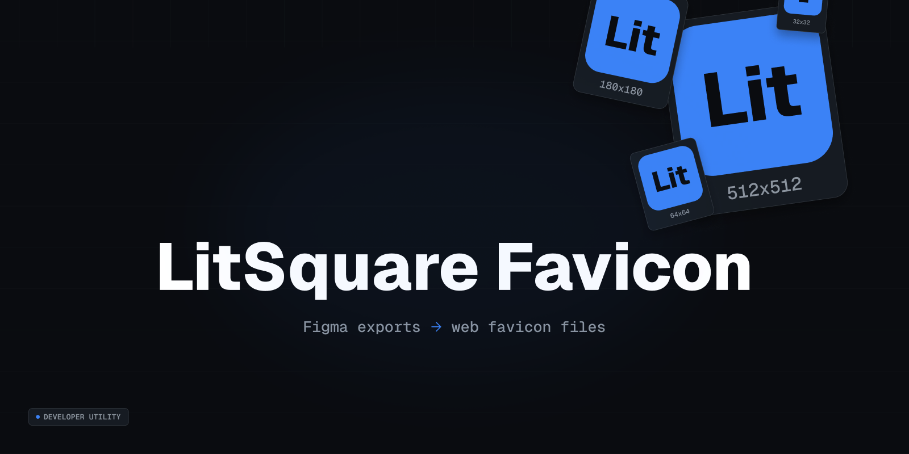

# Litsquare Favicon



Litsquare Favicon turns exports from a project Figma file based on the community scaffold into the favicon files a web project needs:

- `favicon.ico`
- `favicon.svg`
- `favicon-96x96.png`
- `apple-touch-icon.png`
- `icon-192.png`
- `icon-512.png`
- `icon-maskable-192.png`
- `icon-maskable-512.png`
- `site.webmanifest`
- reusable HTML or React head links

The Figma community scaffold is [`litsquare favicon`](https://www.figma.com/community/file/1650255256777018269). Duplicate it or create your own Figma file from it, replace the scaffold visuals with your project artwork, and export from your own file. The export contract in `figma/export-spec.json` is the source of truth.

## Quick Start

```sh
npm install --save-dev litsquare-favicon
npx litsquare-favicon init --framework react
```

Open the [`litsquare favicon` Figma community scaffold](https://www.figma.com/community/file/1650255256777018269), duplicate it into your own Figma account or create a project file from it, replace the scaffold visuals with your own mark, hide the guide layers, export the SVG frames into `litsquare-favicon/source`, then run:

```sh
npx litsquare-favicon generate
npx litsquare-favicon validate
```

For plain HTML projects, run:

```sh
npx litsquare-favicon init --framework html
```

Then paste the generated `litsquare-favicon/head.html` into your document head or framework metadata file.

## Figma Export Contract

Create your own Figma file from the `litsquare favicon` community scaffold, replace the visual artwork, then export these frames from your own file as SVG:

Community file: https://www.figma.com/community/file/1650255256777018269

Before export, hide layers named `safe-area guide` and `maskable safe-area guide`. They are for design review only and must not be included in exported SVG sources. If guide lines are visible in a generated PNG, SVG, or ICO, re-export with those layers hidden and regenerate.

| Figma frame             | Required | Purpose                              |
| ----------------------- | -------- | ------------------------------------ |
| `favicon.svg`           | yes      | Small browser favicon and ICO source |
| `icon.svg`              | no       | Opaque standard app icon source      |
| `icon-maskable.svg`     | no       | Android maskable icon source         |
| `apple-touch-icon.svg`  | no       | Apple touch icon source              |
| `safari-pinned-tab.svg` | no       | Optional Safari pinned tab mask      |

If optional sources are missing, the CLI falls back to `favicon.svg`.

## Commands

### `init`

Creates a config file, source folder, agent instructions, and optional React component.

```sh
npx litsquare-favicon init --target . --framework react
```

Options:

- `--target <dir>`: project root, default `.`
- `--public-dir <dir>`: output directory, default `public`
- `--framework react|html|none`: generated integration files, default `react`
- `--force`: overwrite existing generated files

### `generate`

Reads exported SVGs and writes the favicon asset set.

```sh
npx litsquare-favicon generate --source litsquare-favicon/source --public-dir public
```

### `validate`

Checks that the required public favicon files exist.

```sh
npx litsquare-favicon validate
```

## Agent Usage

This repository includes:

- `SKILL.md` for Codex
- `CLAUDE.md` for Claude
- `templates/skill/codex/SKILL.md`
- `templates/skill/claude/SKILL.md`

`litsquare-favicon init` copies project-local `SKILL.md` and `CLAUDE.md` files so either agent can run the workflow consistently inside another project.

## GitHub Pages

The static documentation site lives in `docs/`. The included `.github/workflows/pages.yml` publishes that folder to GitHub Pages.
